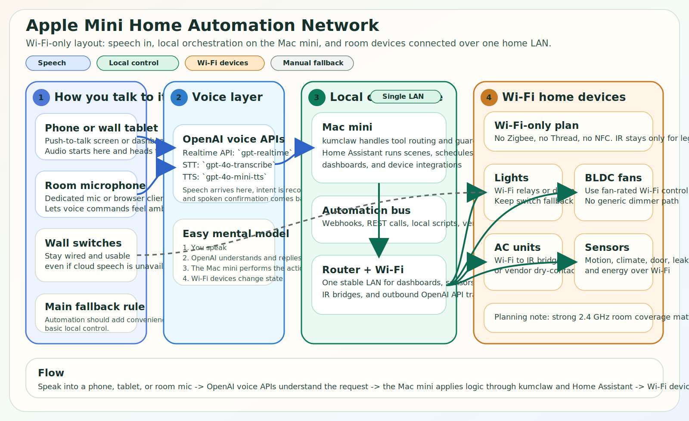
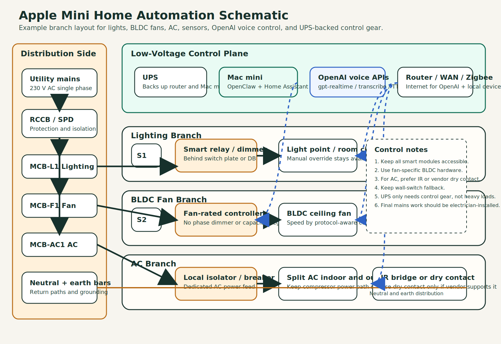

# Mac Mini Home Automation Design

This design uses:

- `kumclaw` on a Mac mini.
- OpenAI APIs for all speech input, intent handling, tool calling, and spoken replies.
- The Mac mini also runs `Home Assistant` in a VM or container, because it gives you better support for mixed device types like lights, BLDC fan controllers, IR AC bridges, sensors, and meters.
- A local client such as a browser dashboard, wall tablet, mobile app, or room microphone streams audio while keeping the API key on the Mac mini server side.

## Network Diagram

## Schematic Diagram

## Recommended Stack

- Voice layer: OpenAI `Realtime API` with `gpt-realtime` for low-latency speech-to-speech control and tool calling.
- Audio fallback layer: `gpt-4o-transcribe` for speech-to-text and `gpt-4o-mini-tts` for spoken replies when you want a split pipeline instead of full realtime speech-to-speech.
- AI layer: `kumclaw` on the Mac mini for routines, dashboards, summaries, guardrails, and local action routing.
- Automation layer: `Home Assistant` for device integrations, scenes, schedules, presence, and the final control surface for home devices.
- Device network: `Wi-Fi` only for relays, sensors, dashboards, and room controllers in this plan. Avoid `Zigbee`, `Thread`, and `NFC`.

## Voice Flow

- User speaks into a phone, browser client, wall tablet, or room mic.
- Audio goes to the Mac mini service and then to OpenAI voice APIs.
- The OpenAI model issues tool calls through `kumclaw`.
- `kumclaw` sends the final device action into `Home Assistant`.
- The spoken confirmation comes back through OpenAI TTS.

## Device Mapping

- Lights: Wi-Fi smart relay or dimmer modules placed behind switch plates or in the distribution box.
- BLDC fans: use a fan-rated controller that explicitly supports BLDC fans and exposes a safe Wi-Fi path or vendor API.
- AC: use an IR bridge for split AC units that already have remotes, or a dry-contact thermostat interface only if the AC model supports it.
- Sensors: motion, door, temperature, humidity, power metering, and leak sensors should connect over Wi-Fi or through a vendor integration that Home Assistant can bridge cleanly.

## Wiring Rules

- Keep manual wall-switch override for every critical load.
- Do not use an old-style phase regulator or capacitor speed controller on a BLDC fan.
- Do not switch split-AC compressor power directly with a generic relay; prefer IR control or the vendor's dry-contact interface.
- Separate low-voltage control wiring and mains wiring.
- Put all mains-side relay work behind proper MCB and RCCB protection and have a qualified electrician do the final installation.

## Operational Rules

- This voice path depends on internet connectivity because OpenAI APIs are cloud-hosted.
- Keep `OPENAI_API_KEY` only on the Mac mini or another trusted server, never in a browser or thin client.
- Check Wi-Fi coverage room by room before buying sensors in bulk, especially for battery-powered endpoints.
- Existing backup power can stay in place if available; no new backup-power purchase is assumed here.
- If you use TTS around other people, disclose that the voice is AI-generated.

## Platform Swap

If you prefer `openHAB` instead of `Home Assistant`, the architecture still works:

- Replace the `Home Assistant` box on the Mac mini with `openHAB`.
- Keep `kumclaw` as the local orchestration layer.
- Keep OpenAI realtime/audio APIs as the speech layer.
- Keep the same Wi-Fi and IR device edges.

The only practical difference is the automation engine and integration catalog, not the physical wiring plan.
