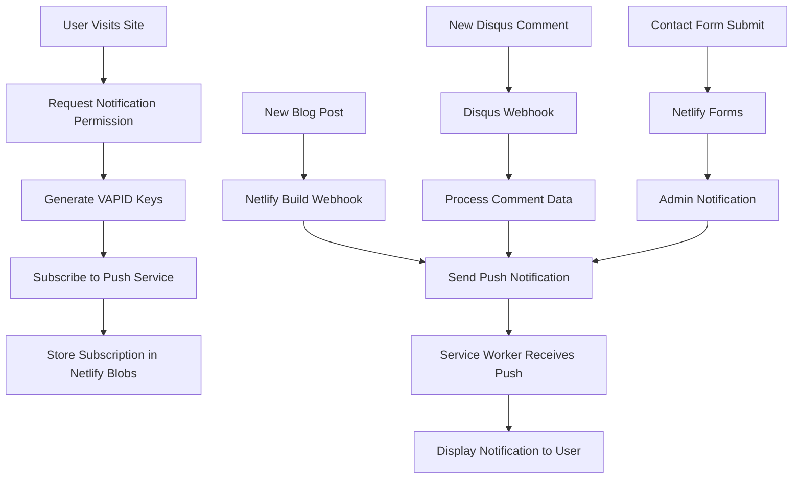
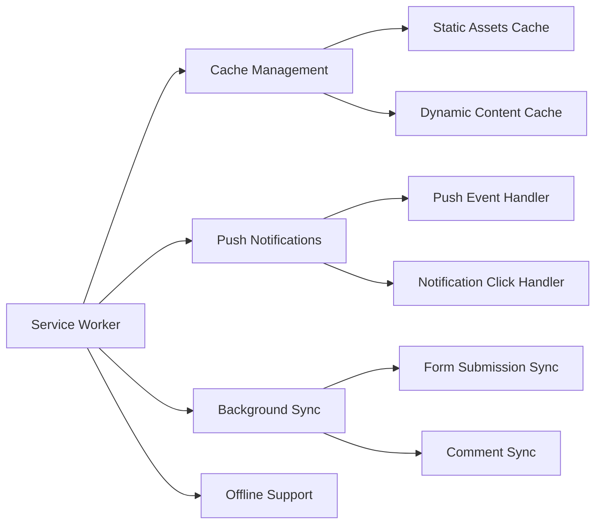

# PWA Implementation Guide with Push Notifications

## Overview

This document outlines the complete implementation of Progressive Web App (PWA) features for Kumar's Personal Portfolio, with **push notifications as a MUST-HAVE feature**. The implementation provides a native app-like experience directly in the browser.

## Table of Contents

1. [Feature Requirements](#feature-requirements)
2. [Technical Architecture](#technical-architecture)
3. [Implementation Phases](#implementation-phases)
4. [Push Notification System](#push-notification-system)
5. [PWA Core Features](#pwa-core-features)
6. [PWA Installation & Usage](#pwa-installation--usage)
7. [Testing Strategy](#testing-strategy)
8. [Success Metrics](#success-metrics)
9. [Deployment Guide](#deployment-guide)

## Feature Requirements

### Core PWA Features
- ✅ **Web App Manifest** - App metadata and installation configuration
- ✅ **Service Worker** - Offline functionality and background sync
- ✅ **Push Notifications** - Real-time updates for blog posts and comments
- ✅ **Install Prompt** - Native app-like installation experience
- ✅ **Offline Support** - Core pages work without internet connection
- ✅ **App Icons** - Multiple sizes for different devices and contexts

### Push Notification Triggers
- 🚨 **New Blog Posts** - Notify subscribers when new content is published
- 🚨 **New Comments** - Real-time notifications for Disqus comments
- 🚨 **Contact Form Submissions** - Admin notifications for new inquiries
- 🚨 **Weekly Digest** - Curated summary of popular content

### PWA Installation Requirements
- ✅ **App Icons** - Multiple sizes for different devices and contexts
- ✅ **Install Prompt** - Custom installation experience
- ✅ **Privacy Policy** - Required for push notifications
- ✅ **Performance Optimization** - Lighthouse PWA score > 90
- ✅ **Offline Support** - Core functionality without internet

## Technical Architecture

### Push Notification Flow


### Service Worker Architecture


## Implementation Phases

### Phase 1: Push Notification Infrastructure (CRITICAL)
**Duration:** Week 1
**Priority:** HIGH

#### 1.1 VAPID Keys Generation
```bash
# Generate VAPID keys for push notifications
npx web-push generate-vapid-keys
```

#### 1.2 Service Worker Implementation
- Enhanced service worker with push notification handling
- Cache management for offline functionality
- Background sync for form submissions

#### 1.3 Push Notification Service
- Client-side push notification management
- Subscription handling and storage
- Permission request flow

#### 1.4 Netlify Functions
- Push subscription storage
- Notification sending service
- Webhook handlers for triggers

### Phase 2: Integration with Existing Systems
**Duration:** Week 2
**Priority:** HIGH

#### 2.1 Disqus Integration
- Webhook setup for new comments
- Real-time comment notifications
- Comment moderation notifications

#### 2.2 Contact Form Integration
- Form submission notifications
- Admin alert system
- User confirmation notifications

#### 2.3 Blog Post Integration
- Build webhook integration
- New post publication notifications
- Content update alerts

### Phase 3: PWA Core Features
**Duration:** Week 3
**Priority:** MEDIUM

#### 3.1 Web App Manifest
- Complete manifest configuration
- App icons and screenshots
- Shortcuts and categories

#### 3.2 Offline Functionality
- Static asset caching
- API response caching
- Offline page implementation

#### 3.3 Install Prompts
- Custom install button
- Installation analytics
- User engagement tracking

### Phase 4: PWA Installation & User Experience
**Duration:** Week 4
**Priority:** HIGH

#### 4.1 TWA Configuration
- Android app wrapper setup
- Trusted Web Activity configuration
- App signing and deployment

#### 4.2 Play Store Assets
- Screenshots and feature graphics
- App description and metadata
- Privacy policy and terms

#### 4.3 Performance Optimization
- Lighthouse PWA score optimization
- Core Web Vitals improvement
- Bundle size optimization

## Push Notification System

### VAPID Configuration
```javascript
// Environment variables required
VAPID_PUBLIC_KEY=your_vapid_public_key
VAPID_PRIVATE_KEY=your_vapid_private_key
VAPID_EMAIL=your_email@example.com
```

### Service Worker Push Handling
```javascript
// Push event listener
self.addEventListener('push', event => {
  const options = {
    body: event.data ? event.data.text() : 'New update available!',
    icon: '/icons/icon-192x192.png',
    badge: '/icons/badge-72x72.png',
    vibrate: [100, 50, 100],
    data: {
      dateOfArrival: Date.now(),
      primaryKey: 1
    },
    actions: [
      {
        action: 'explore',
        title: 'View Post',
        icon: '/icons/checkmark.png'
      },
      {
        action: 'close',
        title: 'Close',
        icon: '/icons/xmark.png'
      }
    ]
  };

  event.waitUntil(
    self.registration.showNotification('Kumar\'s Portfolio', options)
  );
});
```

### Notification Triggers

#### Blog Post Notifications
```javascript
// Trigger: New blog post published
{
  title: 'New Blog Post Published!',
  body: 'Check out the latest insights and updates',
  url: '/blog',
  icon: '/icons/blog-notification.png'
}
```

#### Comment Notifications
```javascript
// Trigger: New Disqus comment
{
  title: 'New Comment on Blog Post',
  body: `${author.name} commented: "${message.substring(0, 100)}..."`,
  url: `/blog/${postSlug}`,
  icon: '/icons/comment-notification.png'
}
```

#### Contact Form Notifications
```javascript
// Trigger: New contact form submission
{
  title: 'New Contact Form Submission',
  body: `From: ${name} (${email})`,
  url: '/admin/contact-forms',
  icon: '/icons/contact-notification.png'
}
```

## PWA Core Features

### Web App Manifest
```json
{
  "name": "Kumar's Personal Portfolio",
  "short_name": "Kumar Portfolio",
  "description": "Personal portfolio with push notifications for blog updates and comments",
  "start_url": "/",
  "display": "standalone",
  "background_color": "#f9fafb",
  "theme_color": "#3b82f6",
  "orientation": "portrait-primary",
  "scope": "/",
  "lang": "en",
  "categories": ["portfolio", "blog", "professional"],
  "icons": [
    {
      "src": "/icons/icon-192x192.png",
      "sizes": "192x192",
      "type": "image/png",
      "purpose": "any maskable"
    },
    {
      "src": "/icons/icon-512x512.png",
      "sizes": "512x512",
      "type": "image/png",
      "purpose": "any maskable"
    }
  ],
  "shortcuts": [
    {
      "name": "Blog",
      "short_name": "Blog",
      "description": "Read latest blog posts",
      "url": "/blog",
      "icons": [{ "src": "/icons/blog-shortcut.png", "sizes": "96x96" }]
    },
    {
      "name": "Subscribe",
      "short_name": "Subscribe",
      "description": "Enable push notifications",
      "url": "/subscribe",
      "icons": [{ "src": "/icons/notification-shortcut.png", "sizes": "96x96" }]
    }
  ]
}
```

### Service Worker Caching Strategy
```javascript
// Cache strategies
const CACHE_STRATEGIES = {
  STATIC_ASSETS: 'cache-first',
  API_RESPONSES: 'network-first',
  IMAGES: 'cache-first',
  HTML_PAGES: 'network-first'
};
```

## PWA Installation & Usage

### Installation Methods

#### 1. Browser Install Prompt
Modern browsers automatically detect PWA capabilities and show install prompts:
- **Chrome/Edge**: "Install app" button in address bar
- **Safari**: "Add to Home Screen" from share menu
- **Firefox**: "Install" option in address bar

#### 2. Manual Installation
Users can manually install the PWA:
1. Open the website in a supported browser
2. Look for install prompt or use browser menu
3. Click "Install" or "Add to Home Screen"
4. App appears in app launcher/home screen

#### 3. Desktop Installation
PWAs can be installed on desktop operating systems:
- **Windows**: Install as desktop app via Edge/Chrome
- **macOS**: Install via Safari or Chrome
- **Linux**: Install via Chrome/Chromium

### User Experience Features

#### App-like Experience
- **Full-screen mode**: No browser UI when launched from app icon
- **Standalone display**: Looks and feels like a native app
- **App icon**: Custom icon in app launcher/home screen
- **Splash screen**: Branded loading experience

#### Offline Capabilities
- **Cached pages**: Core pages work without internet
- **Service worker**: Background sync and caching
- **Offline indicator**: Clear messaging when offline
- **Graceful degradation**: Fallback content when needed

#### Push Notifications
- **Real-time updates**: Instant notifications for new content
- **User control**: Easy enable/disable in settings
- **Rich notifications**: Images, actions, and deep linking
- **Cross-platform**: Works on mobile and desktop

## Testing Strategy

### PWA Testing Checklist
- [ ] **Lighthouse PWA Audit** - Score > 90
- [ ] **Service Worker Registration** - Proper installation and activation
- [ ] **Manifest Validation** - All required fields present
- [ ] **Offline Functionality** - Core pages work without internet
- [ ] **Install Prompt** - Functional on mobile devices
- [ ] **Push Notifications** - Working on desktop and mobile
- [ ] **Notification Permissions** - Proper permission flow
- [ ] **Background Sync** - Form submissions sync when online

### Push Notification Testing
- [ ] **Permission Request** - User can grant/deny permissions
- [ ] **Subscription Management** - Proper subscription storage
- [ ] **Notification Display** - Notifications appear correctly
- [ ] **Click Handling** - Notifications open correct URLs
- [ ] **Action Buttons** - Custom actions work properly
- [ ] **Webhook Integration** - Triggers work from external sources

### Android Testing
- [ ] **TWA Installation** - App installs from Play Store
- [ ] **Deep Linking** - URLs open in app correctly
- [ ] **Push Notifications** - Work in Android app
- [ ] **Offline Mode** - App works without internet
- [ ] **Performance** - Smooth scrolling and interactions

## Success Metrics

### Technical Metrics
1. **Lighthouse PWA Score:** > 90
2. **Service Worker Coverage:** 100% of static assets
3. **Offline Functionality:** Core pages accessible offline
4. **Push Notification Delivery:** > 95% success rate
5. **Install Prompt Conversion:** > 15% of visitors

### User Engagement Metrics
1. **Notification Permission Rate:** > 30% of visitors
2. **Notification Click-Through Rate:** > 70%
3. **App Installation Rate:** > 10% of mobile visitors
4. **Return Visitor Rate:** > 40% increase
5. **Session Duration:** > 25% increase

### PWA Performance Metrics
1. **Installation Rate:** > 10% of mobile visitors
2. **User Retention:** > 60% after 7 days
3. **Performance Score:** > 90 (Lighthouse PWA)
4. **Offline Usage:** > 20% of sessions
5. **Notification Engagement:** > 70% click-through rate

## Deployment Guide

### Environment Setup
```bash
# Install required dependencies
npm install web-push vite-plugin-pwa @netlify/blobs

# Generate VAPID keys
npx web-push generate-vapid-keys

# Set environment variables
export VAPID_PUBLIC_KEY="your_public_key"
export VAPID_PRIVATE_KEY="your_private_key"
export VAPID_EMAIL="your_email@example.com"
```

### Netlify Configuration
```toml
# netlify.toml additions
[build.environment]
  VAPID_PUBLIC_KEY = "your_public_key"
  VAPID_PRIVATE_KEY = "your_private_key"
  VAPID_EMAIL = "your_email@example.com"

[[headers]]
  for = "/manifest.json"
  [headers.values]
    Content-Type = "application/manifest+json"
    Cache-Control = "public, max-age=31536000"

[[headers]]
  for = "/sw.js"
  [headers.values]
    Content-Type = "application/javascript"
    Cache-Control = "public, max-age=0"
```

### Build Process
```bash
# Development
npm run dev

# Production build
npm run build

# PWA testing
npm run test:pwa

# Lighthouse audit
npm run lighthouse
```

## File Structure

```
src/
├── components/
│   ├── NotificationPermission.jsx
│   ├── InstallPrompt.jsx
│   └── OfflineIndicator.jsx
├── services/
│   ├── pushNotificationService.js
│   ├── serviceWorkerService.js
│   └── cacheService.js
├── pages/
│   ├── Notifications.jsx
│   └── Offline.jsx
└── hooks/
    ├── usePushNotifications.js
    ├── useServiceWorker.js
    └── useInstallPrompt.js

public/
├── manifest.json
├── sw.js
├── icons/
│   ├── icon-72x72.png
│   ├── icon-192x192.png
│   ├── icon-512x512.png
│   └── badge-72x72.png
└── screenshots/
    ├── desktop-screenshot.png
    └── mobile-screenshot.png

netlify/functions/
├── push-subscription.js
├── send-push-notification.js
├── disqus-webhook.js
└── blog-publish-notification.js
```

## Security Considerations

### Push Notification Security
- VAPID keys stored securely in environment variables
- Subscription data encrypted in Netlify Blobs
- Rate limiting on notification sending
- User consent tracking and management

### PWA Security
- HTTPS required for all PWA features
- Content Security Policy updated for service workers
- Secure service worker scope and permissions
- Regular security audits and updates

## Monitoring and Analytics

### Push Notification Analytics
- Subscription rates and trends
- Notification delivery success rates
- Click-through rates by notification type
- User engagement patterns

### PWA Performance Monitoring
- Service worker cache hit rates
- Offline usage statistics
- Install prompt conversion rates
- App usage patterns and retention

## Troubleshooting Guide

### Common Issues
1. **Service Worker Not Registering**
   - Check HTTPS requirement
   - Verify service worker file path
   - Check browser console for errors

2. **Push Notifications Not Working**
   - Verify VAPID keys configuration
   - Check notification permissions
   - Test with different browsers

3. **Offline Functionality Issues**
   - Check cache strategies
   - Verify static asset paths
   - Test network conditions

4. **Android TWA Issues**
   - Verify asset statements
   - Check app signing
   - Test deep linking

## Future Enhancements

### Phase 2 Features
- Background sync for comments
- Advanced notification scheduling
- User notification preferences
- Analytics dashboard for notifications

### Phase 3 Features
- Progressive image loading
- Advanced caching strategies
- Performance optimizations
- Accessibility improvements

## Conclusion

This PWA implementation provides a comprehensive solution for Kumar's Personal Portfolio with push notifications as a core feature. The implementation follows best practices for performance, security, and user experience, delivering a native app-like experience directly in the browser without the complexity of native app development.

The modular architecture allows for easy maintenance and future enhancements, while the comprehensive testing strategy ensures reliability across all platforms and devices.
