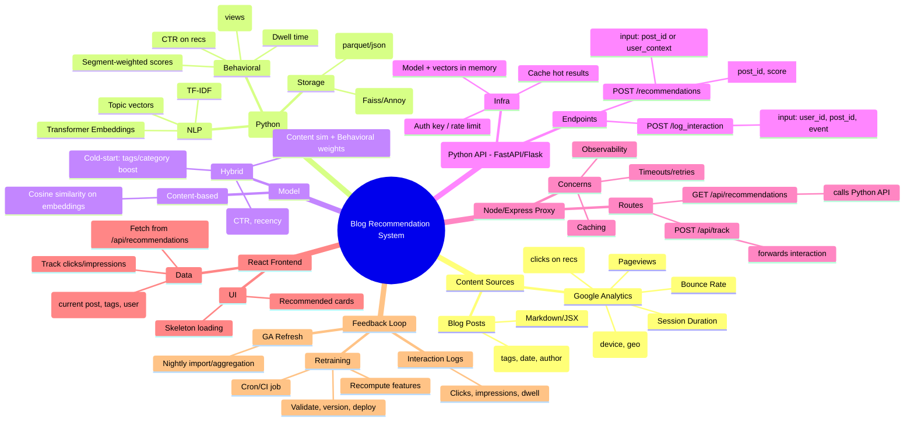
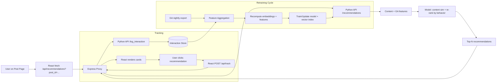
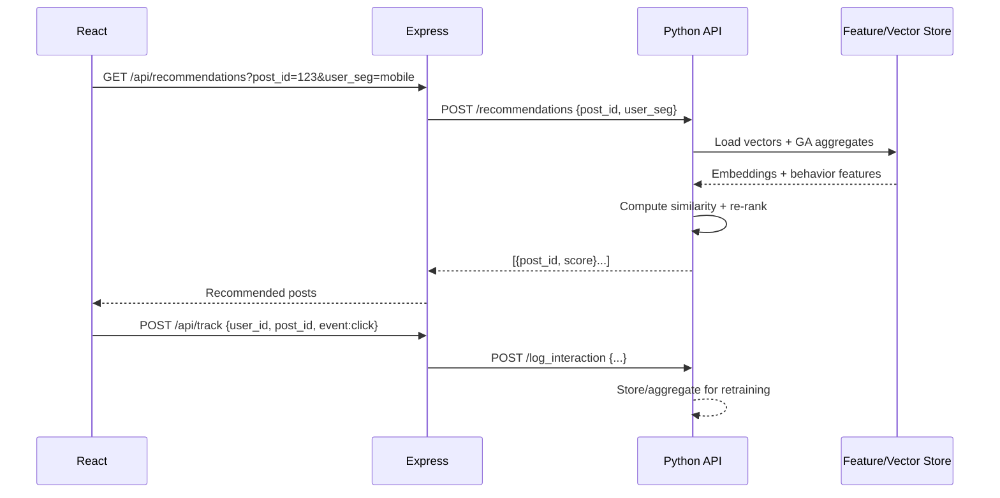

## Recommendation System Architecture

This document visualizes the end-to-end data flow for a hybrid blog recommendation system integrated with React (frontend), Express (proxy backend), a Python model server (FastAPI/Flask), and Google Analytics data.

### Mind map (Mermaid)



### End-to-end flow (Mermaid flowchart)



### Sequence diagram (request → recommendations)



### ASCII quick reference

```
[React UI]
  |  GET /api/recommendations?post_id=...
  v
[Express Proxy]
  |  POST /recommendations
  v
[Python API]
  |-> [Vector/Feature Store] -> embeddings + GA metrics
  |-> Model: content similarity + behavior re-rank
  v
[Top-N Recs] -> back to Express -> React renders

Clicks/Impressions:
React -> POST /api/track -> Express -> Python /log_interaction -> [Interaction Store]

Retraining (cron/CI):
[GA exports] + [Interaction Store] -> Feature recompute -> Train/Update model/index -> Hot-reload Python API
```

### Viewing tips

- GitHub renders Mermaid natively; open this file directly on GitHub to view diagrams.
- Locally, use a Markdown preview that supports Mermaid (e.g., VS Code with "Markdown Preview Mermaid Support").

### PlantUML equivalents

- Mind map: `docs/reco-architecture-mindmap.puml`
- Flow: `docs/reco-architecture-flow.puml`
- Sequence: `docs/reco-architecture-sequence.puml`

Render locally (Docker):

```bash
docker run --rm -v "$(pwd)":/workspace plantuml/plantuml docs/reco-architecture-*.puml
```

Or use a PlantUML extension in your editor (e.g., VS Code "PlantUML").

Using npm scripts:

```bash
npm run puml:render:svg
npm run puml:render:png
```

Using Makefile:

```bash
make puml-svg
make puml-png
```


Last updated: 2025-08-11
